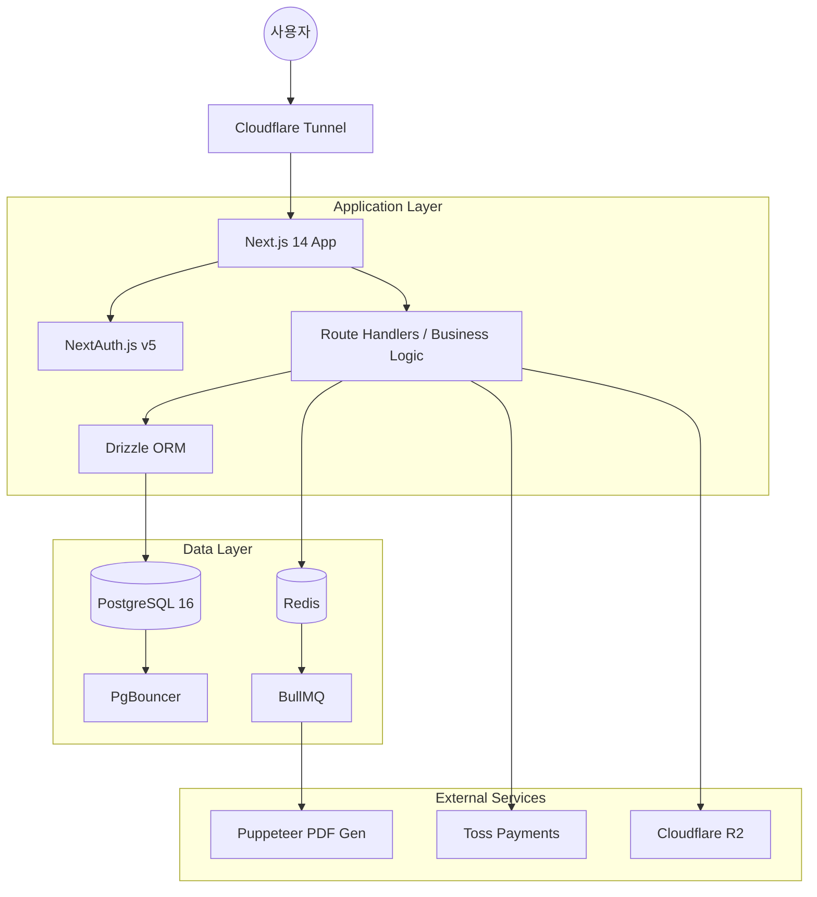
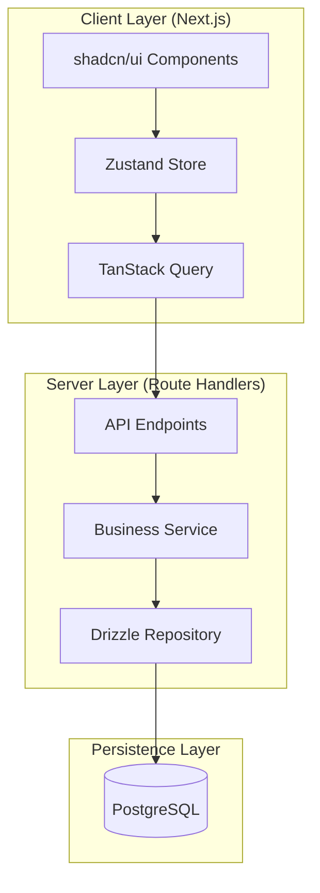
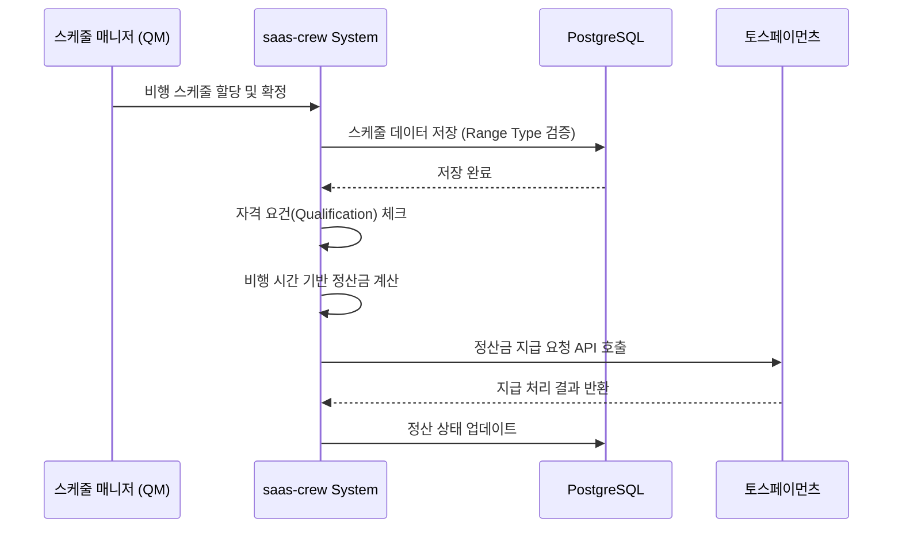
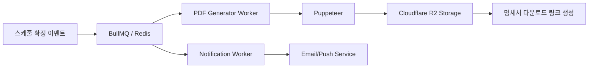
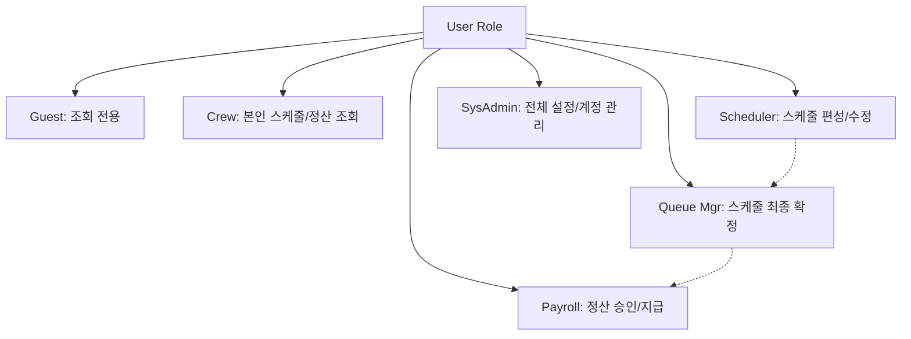
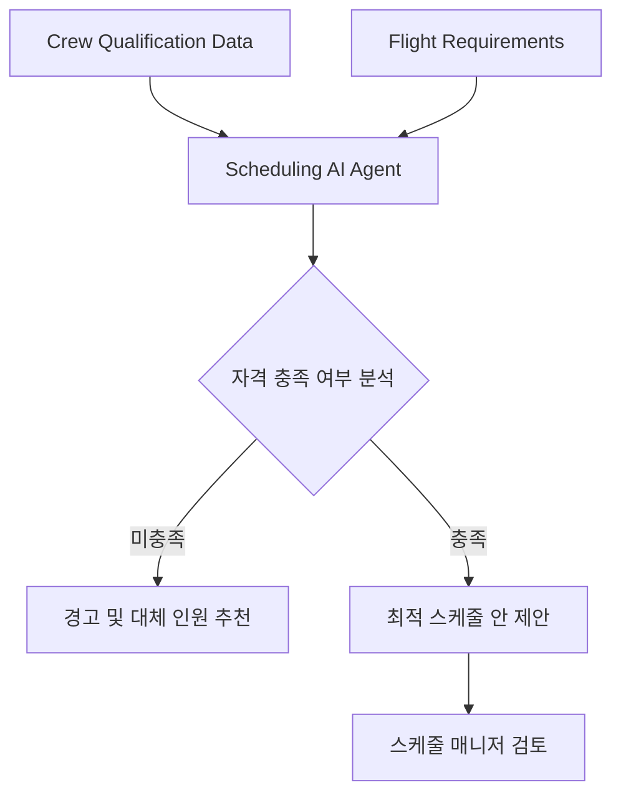
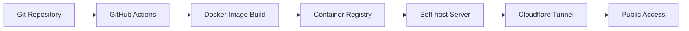
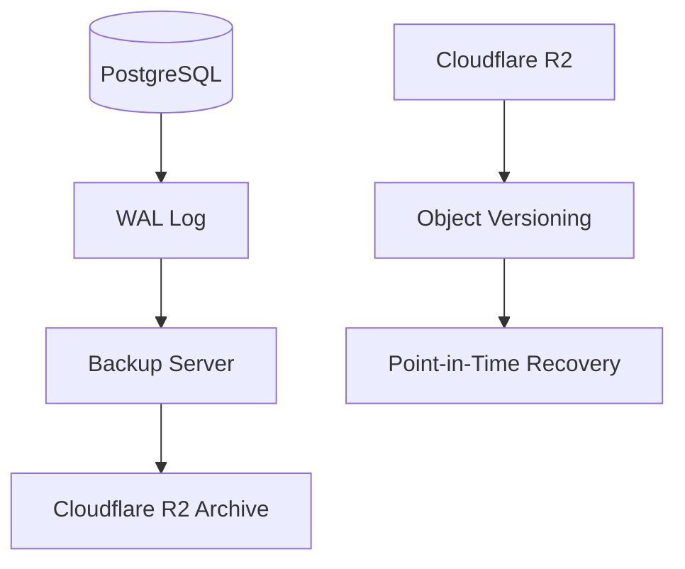
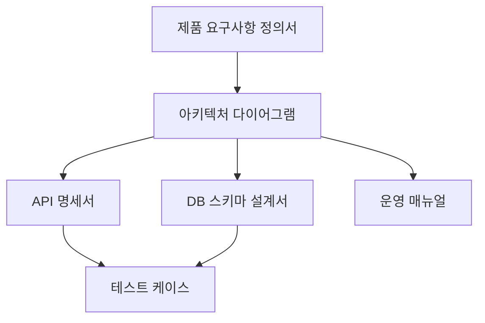

# 아키텍처 다이어그램 정의서 (saas-crew)

본 문서는 항공사 객실 승무원 스케줄, 자격 관리 및 정산 SaaS인 `saas-crew`의 시스템 구조를 정의한다. 본 설계는 `sap-16doc` 패턴을 준수하며, 복잡한 스케줄링 데이터의 무결성과 정산 프로세스의 정확성에 초점을 맞춘다.

## 변경 이력
| 버전 | 날짜 | 수정 내용 | 작성자 | 비고 |
| :--- | :--- | :--- | :--- | :--- |
| v1.0 | 2024-05-22 | 초기 아키텍처 설계 및 다이어그램 정의 | 시스템 설계자 | 최초 작성 |

---

## 1. 시스템 전체
시스템은 Next.js 14 기반의 단일 프로세스 아키텍처를 채택하여 개발 속도를 높이고, PostgreSQL의 Range Types를 통해 스케줄 중복을 방지한다. 외부 결제 및 PDF 생성 엔진을 통해 정산 및 명세서 발행 기능을 수행한다.

## 2. 앱 내부 레이어
Frontend는 Zustand와 TanStack Query를 사용하여 승무원 상태와 서버 데이터를 분리 관리하며, Backend는 Route Handlers를 통해 서버 사이드 로직을 처리하는 계층 구조를 가진다.

## 3. 도메인 핵심 플로우
스케줄링 매니저(이정훈)가 스케줄을 확정하면, 해당 데이터가 정산 엔진으로 전달되어 승무원(박소희)의 월별 정산금으로 산출되는 핵심 흐름을 정의한다.

## 4. 이벤트 플로우
비동기 처리가 필요한 PDF 명세서 생성 및 대량 알림 전송은 BullMQ와 Redis를 통해 큐잉 처리하여 메인 스레드의 블로킹을 방지한다.

## 5. RBAC 체계
역할 기반 접근 제어(RBAC)를 통해 권한을 세분화한다. G(Guest), CA(Cabin Attendant), SC(Scheduler), QM(Queue Manager), PA(Payroll Admin), SA(System Admin)로 구분한다.

## 6. AI Agent
스케줄 최적화 및 자격 누락 방지를 위한 AI Agent 구조이다. 승무원의 자격 만료일과 비행 스케줄을 분석하여 매니저에게 최적의 배정 안을 제안한다.

## 7. CI/CD
Docker self-host 환경을 기반으로 하며, Cloudflare Tunnel을 통해 외부 노출을 최소화하고 보안을 강화한 배포 파이프라인을 구성한다.

## 8. 백업
정산 데이터의 무결성을 위해 PostgreSQL의 WAL(Write Ahead Log) 기반 증분 백업과 R2 스토리지의 객체 버전 관리를 병행한다.

## 9. 문서 관계
본 프로젝트의 표준 문서 체계 간의 상호 참조 관계를 정의한다.

