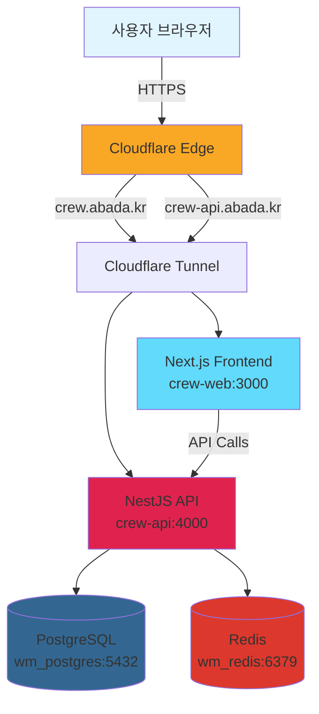
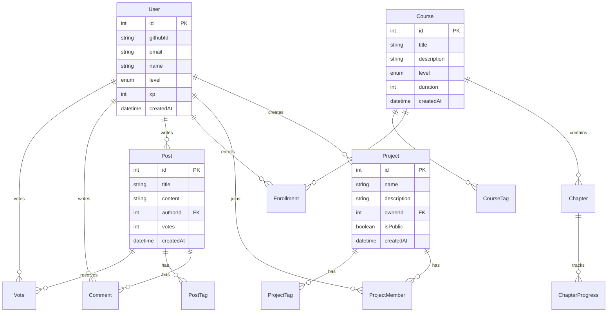
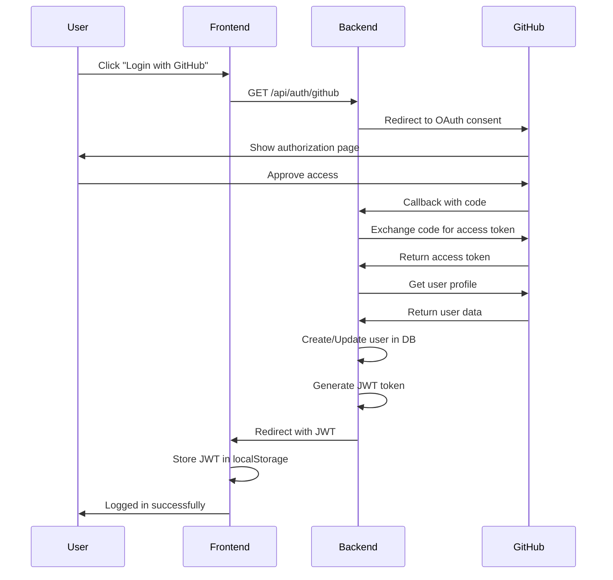
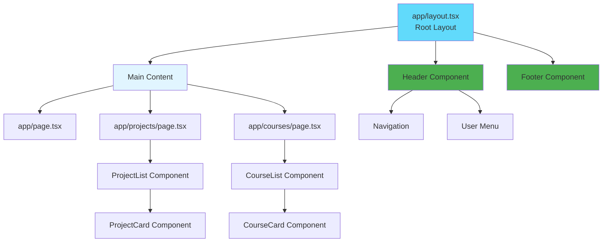
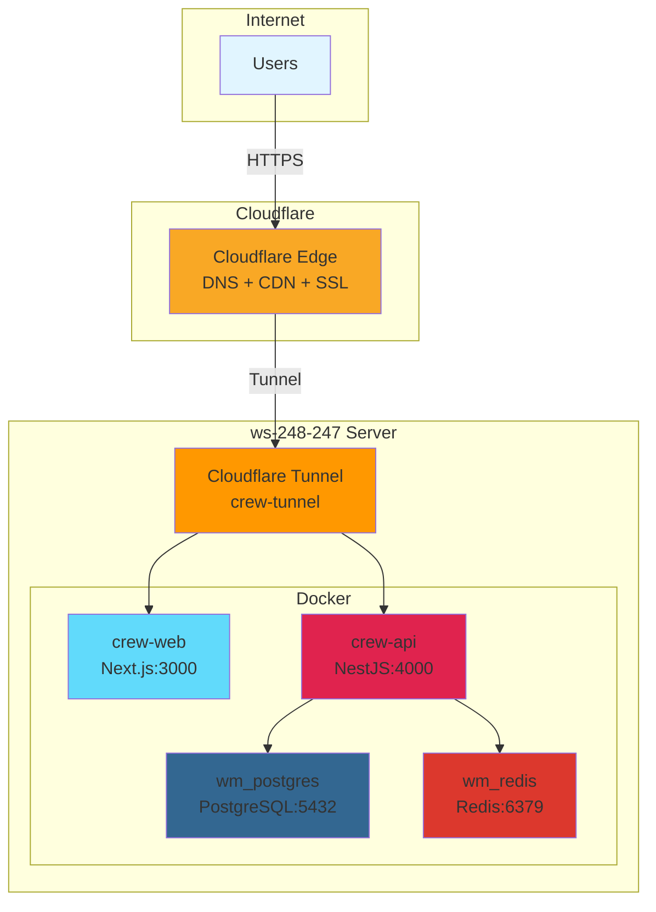
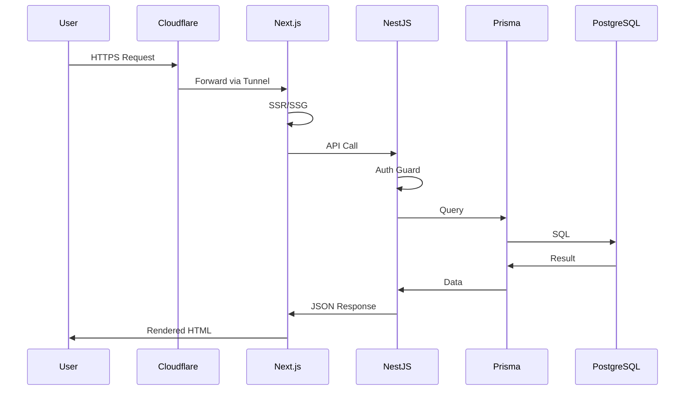

# CrewSpace - Mermaid Diagrams

이 파일은 책에 사용될 모든 Mermaid 다이어그램의 소스 코드를 포함합니다.

---

## fig-01-01: System Architecture Overview



---

## fig-02-01: Database ERD (Entity Relationship Diagram)



---

## fig-02-02: API Endpoint Structure

```mermaid
graph LR
    API[NestJS API Server<br/>:4000]

    API --> Auth[/api/auth]
    API --> Users[/api/users]
    API --> Projects[/api/projects]
    API --> Courses[/api/courses]
    API --> Community[/api/posts]
    API --> Health[/api/health]

    Auth --> AuthGithub[GET /github]
    Auth --> AuthMe[GET /me]

    Users --> UsersGet[GET /:id]
    Users --> UsersPatch[PATCH /:id]

    Projects --> ProjectsList[GET /]
    Projects --> ProjectsCreate[POST /]
    Projects --> ProjectsDetail[GET /:id]

    Courses --> CoursesList[GET /]
    Courses --> CoursesEnroll[POST /:id/enroll]
    Courses --> CoursesProgress[GET /:id/progress]

    Community --> PostsList[GET /]
    Community --> PostsCreate[POST /]
    Community --> PostsVote[POST /:id/vote]

    style API fill:#e0234e
    style Auth fill:#4caf50
    style Users fill:#2196f3
    style Projects fill:#ff9800
    style Courses fill:#9c27b0
    style Community fill:#f44336
```

---

## fig-03-01: Frontend Routing Structure

```mermaid
graph TB
    Root[/ Homepage]

    Root --> Projects[/projects]
    Root --> Courses[/courses]
    Root --> Community[/community]
    Root --> Dashboard[/dashboard]
    Root --> Auth[/auth]

    Projects --> ProjectList[List View]
    Projects --> ProjectDetail[/projects/id]
    Projects --> ProjectNew[/projects/new]

    Courses --> CourseList[List View]
    Courses --> CourseDetail[/courses/id]
    Courses --> CourseLearn[/courses/id/learn]

    Community --> PostList[List View]
    Community --> PostDetail[/community/id]
    Community --> PostNew[/community/new]

    Dashboard --> DashProfile[Profile]
    Dashboard --> DashProjects[My Projects]
    Dashboard --> DashCourses[My Courses]

    Auth --> AuthLogin[/auth/login]
    Auth --> AuthCallback[/auth/callback]

    style Root fill:#e1f5ff
    style Projects fill:#ff9800
    style Courses fill:#9c27b0
    style Community fill:#f44336
    style Dashboard fill:#4caf50
    style Auth fill:#2196f3
```

---

## fig-04-01: GitHub OAuth Flow



---

## fig-05-01: CI/CD Pipeline

```mermaid
graph LR
    Dev[Developer]
    GitHub[GitHub Repository]
    Actions[GitHub Actions]
    Docker[Docker Build]
    Server[ws-248-247 Server]
    Staging[Staging Environment]
    Prod[Production Environment]

    Dev -->|git push| GitHub
    GitHub -->|trigger| Actions
    Actions -->|build| Docker
    Docker -->|deploy| Server

    Server -->|develop branch| Staging
    Server -->|main branch| Prod

    Staging -->|staging-crew.abada.kr| CF1[Cloudflare]
    Prod -->|crew.abada.kr| CF2[Cloudflare]

    style Dev fill:#e1f5ff
    style GitHub fill:#181717
    style Actions fill:#2088ff
    style Docker fill:#2496ed
    style Staging fill:#ffa726
    style Prod fill:#66bb6a
```



---

## fig-06-01: Component Hierarchy (Frontend)



---

## fig-07-01: Deployment Architecture



---

## fig-08-01: Request Flow (User → Database)



---

## SVG 변환 명령어

책에 삽입하기 위해 Mermaid를 SVG로 변환:

```bash
# mermaid-cli 설치
npm install -g @mermaid-js/mermaid-cli

# SVG 생성
mmdc -i diagrams.md -o images/ -b white

# 또는 개별 다이어그램 변환
mmdc -i input.mmd -o output.svg -b white
```

---

**Last Updated**: 2026-02-16
